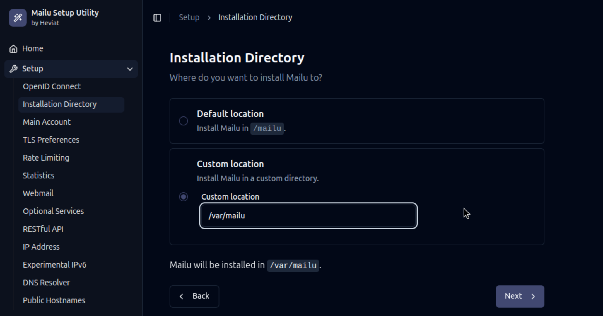

# Mailu Setup Utility

Setting up a new [Mailu](https://github.com/mailu/mailu) instance has never been easier!



Set up a Mailu instance according to your needs. This tool generates configuration files for Mailu without
you having to refer to the documentation all the time.

While the [original Mailu Setup Utility](https://setup.mailu.io/) already offers a lot of configuration
options, this tool offers a much more simplified setup experience, and it also allows you to setup
[Mailu-OIDC](https://github.com/heviat/Mailu-OIDC) easily.

## Usage

Visit the ~~_Mailu Setup Utility by Heviat_~~ and follow the instructions.

> [!WARNING]
> This tool is still in development and was not deployed yet. To use it, you
> can follow the instructions below.

## Developing

If you want to contribute to this SvelteKit app, follow these steps:

1. Clone the repository to your local machine (you only need the `setup` directory of the `oidc-setup` branch):

   ```bash
   git clone -b oidc-setup --single-branch -n --depth=1 --filter=tree:0 https://github.com/heviat/Mailu-OIDC.git
   cd Mailu-OIDC
   git sparse-checkout set --no-cone /setup
   git checkout
   ```

2. Change to the `setup` directory and install dependencies:

   ```bash
   cd setup
   pnpm install
   ```

3. Start a development server:

   ```bash
   pnpm dev

   # or start the server and open the app in a new browser tab
   pnpm dev -- --open
   ```
